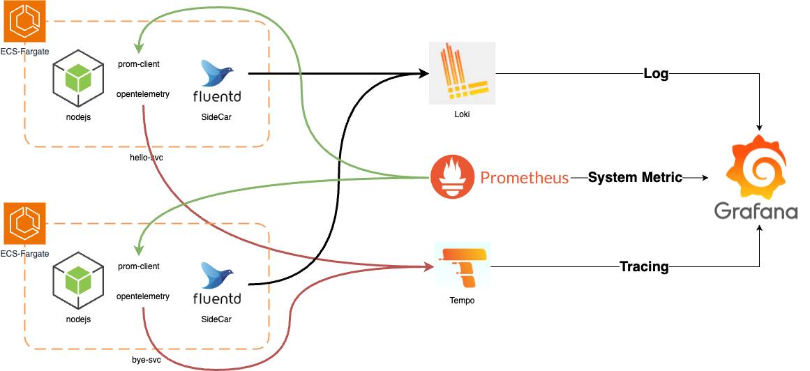

# LGTM Use ECS Fargate

## Architecture



## Project Setup

### Service

- [x] hello
    - [x] service init
    - [x] fluentbit sidecar
    - [x] prom-client
- [x] bye
    - [x] service init
    - [x] fluentbit sidecar
    - [x] prom-client

### Monitoring

- [x] loki
- [x] grafana
- [x] fluentbit
- [x] prometheus
- [x] tempo
- [x] Mimir ... 

## Execute

```sh
    ## Infra Settings
    cd infra && terragrunt ...

    ## Service Settings (reference Makefile)
    make deploy-* 
```

```sh
    ## deploy.sh

    # !/bin/bash

set -e

ECR_REPOSITORY=$1
SERVICE_PATH=$2
ECS_CLUSTER_NAME=$3
ECS_SERVICE_NAME=$4


## Deploy ECR Repository
aws ecr get-login-password --region ap-northeast-2 | docker login --username AWS --password-stdin <account-id>.dkr.ecr.ap-northeast-2.amazonaws.com

cd $SERVICE_PATH 
docker build -t <account-id>.dkr.ecr.ap-northeast-2.amazonaws.com/$ECR_REPOSITORY:latest .
docker push <account-id>.dkr.ecr.ap-northeast-2.amazonaws.com/$ECR_REPOSITORY:latest

## Deploy ECS Service
aws ecs update-service --cluster $ECS_CLUSTER_NAME --service $ECS_SERVICE_NAME --force-new-deployment
```

```sh
    ## svc-deploy.sh

# !/bin/bash

set -e

ECR_REPOSITORY=$1
SERVICE_PATH=$2
ECS_CLUSTER_NAME=$3
ECS_SERVICE_NAME=$4


## Deploy ECR Repository
aws ecr get-login-password --region ap-northeast-2 | docker login --username AWS --password-stdin <account-id>.dkr.ecr.ap-northeast-2.amazonaws.com

cd $SERVICE_PATH 
docker build -t <account-id>.dkr.ecr.ap-northeast-2.amazonaws.com/$ECR_REPOSITORY:latest .
docker push <account-id>.dkr.ecr.ap-northeast-2.amazonaws.com/$ECR_REPOSITORY:latest

## Register Task Definition
TASK_DEFINITION_ARN=$(aws ecs register-task-definition --cli-input-json file://task_def.json | jq -r '.taskDefinition.taskDefinitionArn')

aws ecs update-service \
  --cluster $ECS_CLUSTER_NAME \
  --service $ECS_SERVICE_NAME \
  --task-definition $TASK_DEFINITION_ARN \
  --force-new-deployment
```

## 회고...

- Mimir는 귀찮아서 안함
- ECS 형태로는 LGTM을 구축하는건 힘들다... K8S 에서 구축하는 것이 더 쉬울듯 하다...
- 그냥 DataDog 쓰는것이 정신건강에 더 좋을듯하다..

## 참고

- <a href="https://grafana.com/docs/loki/latest/configure/examples/configuration-examples/"> Loki Documents </a>